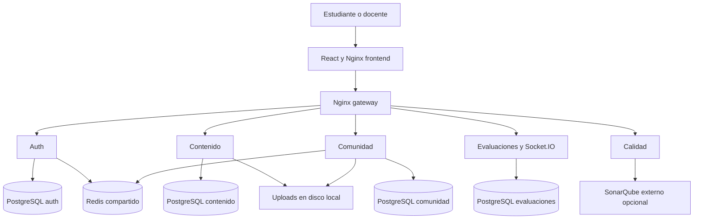
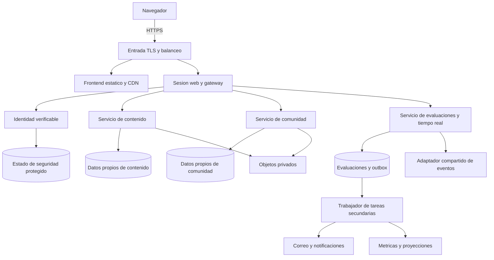

# Comparativa de arquitectura actual y recomendada para PAE

Fecha de revisión: 17 de septiembre de 2026.

**Recomendación:** evolucionar la arquitectura existente hacia servicios por dominio con límites claros, seguridad uniforme, datos durables y operación medible. Para el equipo actual conviene mantener pocos servicios, corregir primero identidad e integridad de evaluaciones, y añadir distribución física cuando la carga y la disponibilidad lo justifiquen.

## Alcance y base de la evaluación

Se revisaron el Compose, el gateway, los servicios de identidad, contenido, comunidad, evaluaciones y calidad, el cliente web, las pruebas y los scripts operativos. La base técnica corresponde al commit `c6c98e8`. Se contrastó con main remoto, `30d359a`: la diferencia encontrada fue exclusivamente README.md. No se realizaron nuevas pruebas de carga ni se inspeccionó una infraestructura productiva; los riesgos inferidos del código se diferencian de fallos reproducidos.

Se toma como escenario de planificación un equipo de cuatro integrantes y el objetivo inicial de cientos de estudiantes indicado por los requisitos. No se presupone presupuesto, proveedor cloud, volumen real de uso ni acuerdo de disponibilidad.

## Arquitectura actual

PAE ya tiene una separación por servicios y bases de datos. Dispone de React/TypeScript/Vite, Nginx para frontend y gateway, cuatro servicios de negocio —auth, content, community y exam— y un servicio técnico de calidad. Utiliza cuatro contenedores PostgreSQL y un Redis compartido. Las carpetas analytics-service y notification-service no constituyen aplicaciones operativas independientes.

El despliegue descrito concentra los componentes en un host con Docker Compose. No define varias réplicas, balanceo entre instancias ni recuperación en otro host. La separación de contenedores y bases permite organizar responsabilidades, pero no constituye por sí misma alta disponibilidad ni escalabilidad horizontal.

Son fortalezas aprovechables: separación inicial de dominios, PostgreSQL transaccional, frontend tipado, infraestructura reproducible, límites de solicitudes, preferencias de interfaz, pruebas, configuración externa y controles para no versionar secretos. La mejora consiste en completar los contratos, garantías y operación de esos componentes.

## Comparación por aspecto

| Aspecto | Situación actual observada | Arquitectura recomendada | Motivo y contrapartida |
| --- | --- | --- | --- |
| Organización | Servicios por dominio, con controladores extensos y varias capacidades reunidas en exam | Mantener los servicios principales; separar internamente transporte, casos de uso, dominio y persistencia | Facilita pruebas y cambios sin pagar inmediatamente el costo de otra frontera de red |
| Despliegue | Un host, nombres y puertos fijos, una instancia por servicio | Compose para desarrollo y piloto; contenedores replicables en una plataforma con balanceo cuando sea necesario | Permite crecer por componente; operar varias instancias exige coordinación, monitoreo y mayor presupuesto |
| Disponibilidad | Gateway, bases y Redis sin redundancia definida; restart local | Recuperación documentada al inicio; después balanceador, réplicas en distintos hosts y bases con failover probado | Reiniciar un proceso no resuelve la pérdida del host o del disco |
| Identidad | JWT propio, login rápido simulado, 2FA separado y rol docente elegido desde el cliente | Identidad verificable con OIDC o autenticación propia corregida; aprobación docente; MFA integrado | Cierra vías de suplantación y privilegios indebidos; un proveedor de identidad reduce código sensible, pero añade dependencia operativa |
| Sesiones web | Bearer token en localStorage | Sesión de navegador con cookie HttpOnly, Secure y SameSite, preferiblemente mediante una capa backend para frontend | Reduce exposición directa del token a JavaScript; requiere CSRF, verificación de origen y protección XSS igualmente |
| Confianza entre servicios | Secreto JWT compartido y validadores con distinta revocación | Emisor central, firma asimétrica y validación de issuer, audience, algoritmos y expiración; política uniforme de revocación | Los servicios verificadores no necesitan poder firmar; la rotación y la disponibilidad de claves requieren diseño |
| Autorización | Comprobaciones de rol y algunas de pertenencia; sockets aceptan un ID de sala válido sintácticamente | Autorizar recurso, propietario, comunidad y sala en cada operación HTTP y evento | Un token válido no acredita permiso para ver cualquier examen o conversación |
| Secretos y red | .env excluido de Git, pero el archivo completo se inyecta en varios servicios y bases | Secretos mínimos por servicio, rotación, redes privadas y TLS; reducir puertos y permisos | Un contenedor comprometido debe tener un alcance limitado; .gitignore solo protege la publicación |
| Evaluaciones | Resultados persistidos; operaciones encadenadas y actualización de respuestas/marcador JSON | Transacciones, control de concurrencia, restricción de unicidad e idempotencia; servidor como autoridad de tiempo y calificación | Evita sobrescritura entre respuestas simultáneas, estados parciales y efectos duplicados |
| Datos | Cuatro bases y procesos PostgreSQL; sincronización Sequelize al iniciar | Conservar propiedad de datos por dominio y usar migraciones; decidir aislamiento físico según costo/carga | Se pueden alojar bases lógicas en una instancia gestionada con roles distintos; comparten recursos y fallo, por lo que no reemplaza aislamiento físico |
| Tiempo real | Un servidor Socket.IO, conexiones en memoria y emisiones locales | Adaptador compartido, reconexión desde estado persistido, permisos y difusión por sala; afinidad si continúa polling | Las réplicas necesitan entregar eventos entre instancias; el adaptador no vuelve atómicas las notas o puntuaciones |
| Redis | Caché y claves de seguridad juntos con allkeys-lru; errores de blacklist devuelven false | Separar caché descartable del estado de seguridad; política de memoria, persistencia y errores adecuada a cada uso | Expulsar una caché de ranking es tolerable; perder una revocación o contador de acceso cambia la seguridad |
| Archivos | PDFs y multimedia en rutas del host | Almacenamiento de objetos privado, autorización previa y enlaces temporales; cuarentena y validación de archivos | Independiza recursos del servidor y facilita réplicas; introduce costo de almacenamiento y transferencia |
| Tareas diferidas | Logros y otras operaciones en el recorrido de evaluación; correo pendiente | Outbox transaccional y trabajador para tareas secundarias; cola durable al crecer | Una caída del correo no debe impedir guardar el examen; hay que manejar reintentos, duplicados y mensajes fallidos |
| Rendimiento | Pools, cachés y límites configurables; script de carga principalmente de lectura | Medir carga mixta, consultas, índices, paginación, p95/p99 y conexiones; escalar el cuello de botella observado | Aumentar conexiones o contenedores sin medir puede saturar PostgreSQL y empeorar la latencia |
| Observabilidad | Logs de consola, salud básica y SonarQube | Logs estructurados sin datos sensibles, métricas, trazas y alertas por experiencia de usuario | Permite distinguir saturación, dependencias lentas y fallos; exige retención y costos de telemetría |
| Recuperación | Script manual de volcados SQL, sin programación/restauración acreditadas | Backups automáticos, cifrados, externos al host y restauraciones ensayadas; recuperación temporal según objetivo | Una copia que nunca se restaura no prueba continuidad; backups y replicación tienen funciones distintas |
| Calidad y entrega | Compilación y algunas suites en CI; cobertura Sonar limitada | Integración con bases reales, contratos, permisos, concurrencia, E2E, dependencias e imágenes; staging y rollback | Verifica el comportamiento desplegado; requiere mantener entornos de prueba representativos |
| Privacidad y accesibilidad | Políticas y ajustes visuales básicos | Minimización, retención, auditoría de accesos y pruebas de teclado/lectores/dispositivos | Protege expedientes académicos y permite acceso inclusivo; requiere responsables además de tecnología |
| Costos | Varias instancias locales, con operación manual | Pocos componentes, servicios gestionados donde reduzcan carga operativa y límites de consumo | Evaluar infraestructura, transferencia, guardias y tiempo del equipo; no existe ahorro universal por usar microservicios |

## Hallazgos que condicionan la recomendación

### Identidad y privilegios

En [authController](../backend/services/auth-service/src/controllers/authController.js), `register` utiliza `isTeacher` para asignar rol, y `quickLogin` genera una sesión a partir del correo recibido sin comprobar un proveedor OAuth. Los endpoints 2FA reciben una sesión ya autenticada y no constituyen un segundo factor obligatorio durante el login. Son bloqueantes para una exposición pública con datos reales, aunque el sistema compile y responda correctamente.

La aplicación guarda tokens en [localStorage](../frontend/src/services/api.ts). Para la web propongo una sesión del navegador mediante cookies protegidas y una capa backend que mantenga los tokens fuera de JavaScript. HttpOnly reduce el robo directo de la cookie por scripts; no elimina las acciones que un XSS pueda realizar en nombre del usuario. Deben diseñarse también CSRF, CSP, CORS, expiración y cierre de sesión. [Referencia OWASP sobre almacenamiento web](https://cheatsheetseries.owasp.org/cheatsheets/HTML5_Security_Cheat_Sheet.html).

La revocación de auth consulta Redis; content, community y exam verifican directamente firma y expiración. Debe existir una decisión uniforme: sesiones consultables y revocables, o tokens breves con una ventana de revocación explícita y controles adicionales. La autorización sigue siendo responsabilidad de cada dominio. [Referencia de seguridad entre servicios](https://cheatsheetseries.owasp.org/cheatsheets/Microservices_Security_Cheat_Sheet.html).

### Redis y secretos

[Compose](../docker-compose.yml) usa `env_file: .env` en aplicaciones y bases, lo que entrega variables ajenas a cada componente. Recomiendo declarar solo sus dependencias necesarias; en producción, utilizar un mecanismo de secretos con permisos y rotación.

El Redis compartido emplea `allkeys-lru`, mientras [auth/config/redis.js](../backend/services/auth-service/src/config/redis.js) guarda revocaciones y contadores. Esa política puede expulsar cualquier clave candidata bajo presión de memoria. Además, `isBlacklisted` devuelve false si Redis falla: el error equivale a no encontrar revocación. Es una combinación que debe resolverse antes de aumentar carga.

Separaría caché y estado de seguridad. Para este último se necesita un almacenamiento y comportamiento ante fallos definidos; elegir `noeviction` exige manejar errores de escritura cuando se llena, no los elimina. Los índices lógicos de un mismo Redis no aíslan su política global de memoria. [Referencia de políticas de Redis](https://redis.io/docs/latest/develop/reference/eviction/).

### Integridad de respuestas y puntos

[LearningController](../backend/services/exam-service/src/controllers/learningController.js) guarda resultados y después crea revisiones, evalúa logros y procesa gamificación. Si una operación posterior falla, puede quedar una evaluación finalizada con efectos secundarios incompletos. En las respuestas en vivo, leer y reemplazar arrays de marcador/respuestas sin un bloqueo o control de versión visible introduce riesgo de actualizaciones perdidas al concurrir usuarios. Es una inferencia del recorrido de código; no se reprodujo una carrera en esta revisión.

Gamificación ya dispone de claves de idempotencia únicas, una base aprovechable. Sin embargo, [awardPoints](../backend/services/exam-service/src/services/gamificationService.js) crea el evento y actualiza el total del perfil en operaciones separadas. El diseño debe garantizar que ambos cambien en la misma transacción o que exista una recuperación verificable.

Recomiendo persistir cada respuesta con identidad única por intento/partida, pregunta y estudiante, aplicar control de concurrencia sobre el estado compartido, y hacer atómico el cierre del intento. Los reintentos deben recuperar un resultado consistente sin volver a otorgar puntos. El límite temporal se determina en el servidor; el reloj y `timeSpent` del navegador son datos informativos, no autoridad.

### Escalado de Socket.IO

[LearningSocket](../backend/services/exam-service/src/realtime/learningSocket.js) mantiene conexiones por proceso y no configura un adaptador distribuido. El estado de partidas sí se guarda en PostgreSQL: no todo el motor vive en memoria. Al incorporar réplicas, los eventos deben propagarse entre instancias y la reconexión debe reconstruir el estado desde una fuente persistente.

Si se conserva HTTP long-polling, el balanceador necesita afinidad de sesión. Con solo WebSocket se elimina ese requisito concreto, a cambio de perder el fallback de transporte. En ambos casos, la comunicación entre servidores sigue necesitando un diseño compartido. [Documentación de Socket.IO para varios nodos](https://socket.io/docs/v4/using-multiple-nodes/).

Los handlers de unión a salas comprueban el formato del ID, sin consultar pertenencia. También se emiten actualizaciones de partidas al lobby global. Recomiendo permisos por sala y separar un evento público mínimo de la información detallada de participantes; debe revisarse el contenido de cada payload antes de decidir su audiencia.

## Propuesta de evolución

Es un diagrama lógico de destino. No prescribe desplegar de inmediato una máquina por caja. Identidad y sesión web pueden evolucionar dentro de auth; el trabajador puede leer inicialmente una outbox en PostgreSQL. Una cola externa se incorpora cuando volumen, múltiples consumidores o necesidad de aislamiento la justifiquen. La telemetría, secretos y backups atraviesan todos los componentes aunque no se dibujen para conservar legibilidad.

La regla educativa central sería: **confirmar al estudiante que su examen quedó guardado después de persistirlo de manera consistente; procesar después las tareas secundarias que admiten demora**. La outbox guarda el evento junto al resultado en una transacción, y el trabajador lo entrega con reintentos. Sus consumidores deben tolerar duplicados; no se promete entrega exactamente una vez por añadir una cola. [Patrón transactional outbox](https://docs.aws.amazon.com/prescriptive-guidance/latest/cloud-design-patterns/transactional-outbox.html).

Dentro de cada servicio se recomienda la separación `HTTP/socket → caso de uso → reglas de dominio → repositorios/adaptadores`. Las reglas de puntuación no deberían depender de Express, correo, Redis ni del componente visual. OpenAPI y esquemas de eventos sirven para comprobar contratos. Las migraciones permiten desplegar cambios de datos con orden y compatibilidad; se debe evitar depender de sincronización automática como política de evolución productiva. [Migraciones Sequelize](https://sequelize.org/docs/v6/other-topics/migrations/).

## Selección del estilo arquitectónico

| Alternativa | Adecuación a PAE | Decisión propuesta |
| --- | --- | --- |
| Evolución de los servicios existentes | Aprovecha código y límites ya creados; permite aislar evaluaciones cuando se mida su carga | Preferida para el proyecto actual |
| Monolito modular | Puede simplificar despliegue, transacciones y operación para cuatro desarrolladores; también puede tener réplicas | Alternativa válida si medir costos demuestra que la distribución actual perjudica al equipo; requiere evaluar una migración, no fusionar todo automáticamente |
| Muchos servicios pequeños, Kubernetes, malla y broker complejo | Útil con equipos autónomos, varias cargas distintas y operación madura | Posponer hasta tener necesidades medidas y capacidad de mantenerlo |

Un monolito modular no es necesariamente menos escalable ni menos seguro. Los microservicios aportan autonomía, pero también coordinación, fallos de red y consistencia distribuida. En este caso la recomendación aprovecha el punto de partida y minimiza migraciones sin beneficio comprobado. [Guía de arquitectura de microservicios de Microsoft](https://learn.microsoft.com/en-us/azure/architecture/guide/architecture-styles/microservices).

## Escalabilidad y validación de capacidad

El script [load-test-200-students](../scripts/load-test-200-students.mjs) reutiliza una cuenta/token para generar actividad principalmente de lectura y conexiones de socket. Es útil como señal inicial, pero no demuestra doscientos estudiantes distintos resolviendo y enviando exámenes simultáneamente.

Como ejemplo de dimensionamiento, no como medición: 200 estudiantes con un guardado cada 30 segundos producirían aproximadamente 6,7 guardados por segundo en promedio. El inicio y cierre simultáneos de una evaluación podrían producir picos mucho mayores. Importan esos picos, consultas y tamaño de payload, además del número de conexiones.

La prueba representativa debe incluir estudiantes distintos, carga de materiales, respuestas, entregas simultáneas, chat, reconexión, duplicados y caída de dependencias. Medir p95/p99, errores, bloqueos de DB, event loop, CPU, RAM, conexiones PostgreSQL y cola pendiente. Como objetivos iniciales a acordar —no resultados actuales— se puede evaluar p95 de lectura menor de 500 ms, persistencia de respuesta menor de 1 s y menos de 1 % de fallos inesperados bajo la carga objetivo y condiciones de red definidas.

Antes de replicar, optimizar consultas, índices y payloads. Al añadir instancias, sumar sus pools: tres réplicas con un máximo de 25 conexiones pueden abrir hasta 75 conexiones a su base, más administración y trabajadores. Aumentar ese máximo sin capacidad suficiente puede empeorar el rendimiento. La disponibilidad debe distinguir un piloto con recuperación manual de un servicio con varias zonas/hosts y failover probado.

## Operación, privacidad y calidad

SonarQube analiza código; no demuestra disponibilidad, latencia, recuperación ni experiencia del estudiante. El perfil actual omite auth/community en `sonar.sources` y excluye capas amplias de cobertura. Conviene incorporar esas áreas al control de calidad y añadir pruebas de permisos y concurrencia contra dependencias reales.

La observabilidad recomendada correlaciona una petición entre gateway, servicio, SQL y trabajador. OpenTelemetry permite instrumentar trazas, métricas y logs; se complementa con un sistema de consulta y alertas. No deben registrarse contraseñas, tokens completos, respuestas privadas o documentos personales. [Referencia OpenTelemetry](https://opentelemetry.io/docs/what-is-opentelemetry/).

El servicio de calidad es soporte técnico y no debería impedir el arranque o uso de una evaluación si SonarQube falla. Las comprobaciones de disponibilidad deben diferenciar proceso vivo de servicio preparado para atender su función. Las dependencias no esenciales deben degradarse de forma controlada.

Backups: programar copias cifradas fuera del host, incluir bases y objetos, mantener retención y ensayar restauración. Definir con el responsable cuánto dato puede perderse —RPO— y cuánto puede durar una interrupción —RTO— antes de seleccionar la solución y su costo. Una réplica no reemplaza un backup ante borrados o corrupción lógica.

La arquitectura debe limitar quién ve el desempeño de cada estudiante, separar acceso docente por comunidad, limitar retención de historial y disponer de procedimientos para exportación y eliminación. Estas son capacidades técnicas; no equivalen por sí mismas a certificación legal. Para accesibilidad y redes inestables, probar teclado, foco, lectores, contraste, tamaño de pantalla y recuperación de intentos. El almacenamiento offline debe ser mínimo, separado por usuario y limpiarse al salir; la autoridad de resultados permanece en el servidor.

## Hoja de ruta por condiciones de cierre

| Etapa | Trabajo | Criterio verificable |
| --- | --- | --- |
| 1 Seguridad de acceso | Corregir login rápido, rol docente, 2FA, revocación, permisos de socket, secretos y Redis | Usuario no autorizado no obtiene sesión/rol/datos; cierres y fallos de dependencias cumplen la política acordada |
| 2 Integridad educativa | Transacciones, control de concurrencia, tiempo del servidor, idempotencia y migraciones | Respuestas simultáneas no se pierden; reintentos no duplican resultados/puntos; fallos parciales son recuperables |
| 3 Operación inicial | HTTPS, objetos privados, trabajador, logs/métricas, backups y staging | Un resultado persiste aunque falle el correo; restauración y recuperación demostradas |
| 4 Crecimiento medido | Carga mixta, balanceo, adaptador Socket.IO, varias instancias y pool dimensionado | Dos estudiantes en réplicas distintas comparten estado coherente; se cumple el objetivo de rendimiento acordado |
| 5 Autonomía avanzada | Separar módulos adicionales o adoptar orquestación más compleja | Hay evidencia de necesidad por despliegues, carga, responsabilidad de equipos o costo operativo |

La prioridad recomendada para PAE es proteger identidad y resultados, después asegurar recuperación y operación, y finalmente ampliar capacidad. El cambio de arquitectura se justifica por garantías medibles y carga real; la cantidad de contenedores no es una medida de madurez del producto.
